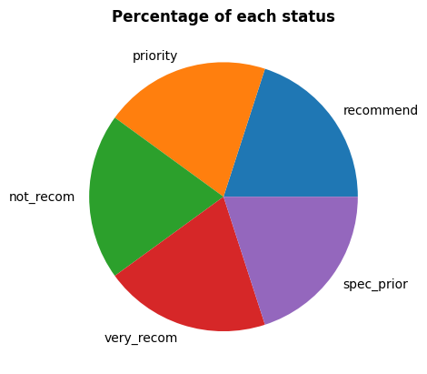
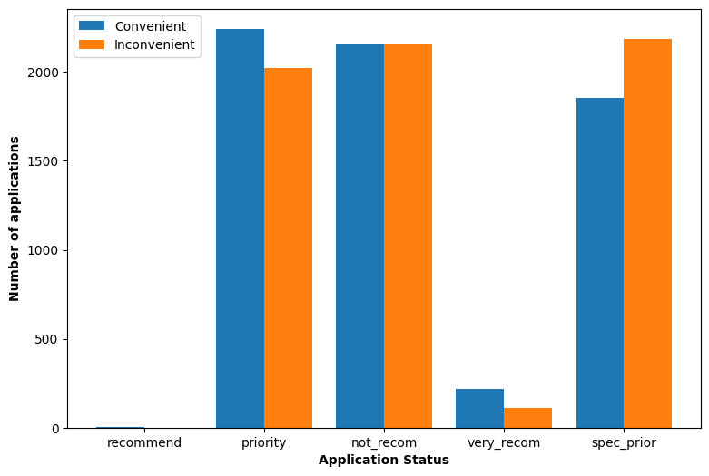
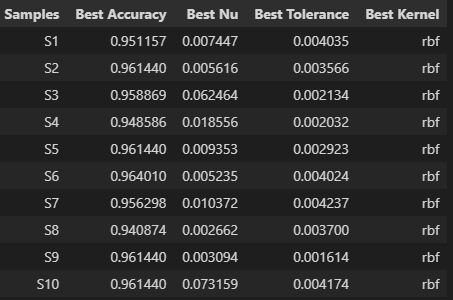

# SVM-parameter-optimization

This project deals with tuning the hyperparameters of SVM machine learning model. 

## About Dataset

Nursery dataset from UCI Machine Learning Library is used. This dataset contains data of various applications for nursery schools. Dataset mainly deals with 3 parameters : 

-  EMPLOY : Employment of parents and child's nursery
-  STRUCT_FINAN : Family structure and financial standings
-  SOC_HEALTH : Social and health picture of the family

## Attribute Information

These 3 parameters are further divided in sub-parameters which are the attributes the this dataset.
Columns names and values are : 

- parents: usual, pretentious, great_pret
- has_nurs: proper, less_proper, improper, critical, very_crit
- form: complete, completed, incomplete, foster
- children: 1, 2, 3, more
- housing: convenient, less_conv, critical
- finance: convenient, inconv
- social: non-prob, slightly_prob, problematic
- health: recommended, priority, not_recom

## Data Analytics

1. ### Proportion of each status of application

Dataset contain almost equal proportion of each class.

2. ### Relationship between application status and financial condition of family

## Method 

To predict the classes NuSVC of sklearn is used. Three parameters namely Nu, Tol(tolerence) and kernel are optimized using the following steps :

1. 10 samples of the dataset are taken.
2. For each sample we randomly choose the value of nu, tol and kernel and calculated the accuracy of model.
3. Repeat step 2 , 1000 times.
4. Found the values of nu, tol and kernel for each sample where accuracy was highest

## Result 

Here Sample S6 has highest accuracy for Nu value 0.005235, tol value 0.004024 and kernel 'rbf'.

